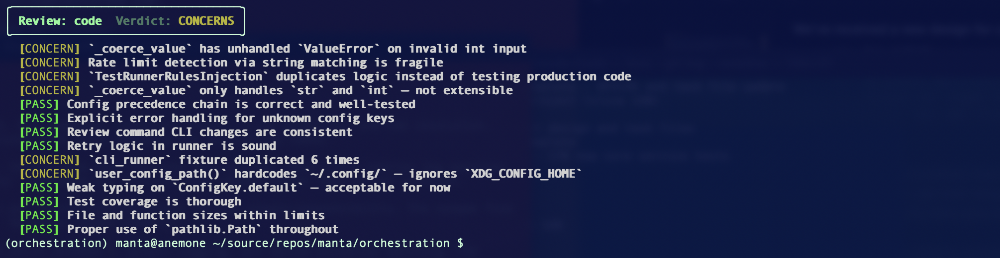

# Orchestration

Repeatable, template-driven code reviews powered by Claude — from the terminal.

Point `orchestration` at a diff, an architecture doc, or a task plan and get back a structured verdict with specific findings. No more freeform "hey Claude, review this" — each review runs against a purpose-built prompt template that tells the agent exactly what to evaluate and how to report what it finds.

```bash
orchestration review code --diff main -v
```


## Why this exists

Code review with LLMs is powerful but inconsistent. The same prompt gets different levels of scrutiny depending on how you phrase it, what context you include, and whether you remembered to mention your project's conventions.

Orchestration makes reviews **repeatable**. A review template defines the system prompt, the tools the agent can use, and the inputs it expects. Run the same template on Monday and Friday and you get structurally consistent output — a verdict (PASS, CONCERNS, or FAIL) and a list of findings with severity levels.

Three built-in templates cover the most common review patterns:

| Template | What it reviews | Example |
|----------|----------------|---------|
| `code` | Source code (optionally scoped to a diff or glob) | `review code --diff main` |
| `arch` | A design doc against an architecture reference | `review arch design.md --against hld.md` |
| `tasks` | A task breakdown against its parent slice design | `review tasks tasks.md --against slice.md` |

The template system is extensible — each template is a YAML file, and adding new review types means writing a new YAML definition and optionally a prompt builder function. See [docs/TEMPLATES.md](docs/TEMPLATES.md) for details.

## Quickstart

### 1. Install

Orchestration requires Python 3.11+ and the [Claude Agent SDK](https://docs.anthropic.com/en/docs/agents-sdk), which needs Node.js 18+.

```bash
git clone https://github.com/ecorkran/orchestration.git
cd orchestration
uv sync
```

<details>
<summary>Using pip instead of uv</summary>

```bash
pip install -e "."
```

</details>

### 2. Configure credentials

Orchestration uses the Claude Agent SDK, which supports two authentication methods:

**Claude Max subscription** (recommended): If you're already signed into Claude Code, you're set — the SDK uses your existing session. No API key needed.
```bash
# Verify you're authenticated
claude --version
```

**API key**: Alternatively, set an Anthropic API key:
```bash
export ANTHROPIC_API_KEY="sk-ant-..."
```

### 3. Run your first review

Review your uncommitted changes against main:

```bash
orchestration review code --diff main -v
```

That's it. You should see Rich-formatted output with a verdict and findings within about 30 seconds.

## Reviews in depth

### Scoping what gets reviewed

Code reviews can be scoped by diff, file pattern, or both:

```bash
# Everything in the project
orchestration review code

# Only changes since main
orchestration review code --diff main

# Only Python files
orchestration review code --files "src/**/*.py"

# Changes to Python files since main
orchestration review code --diff main --files "src/**/*.py"
```

### Adding project-specific rules

Point reviews at a rules file to include project conventions in the agent's system prompt:

```bash
orchestration review code --diff main --rules ./rules/python.md
```

Your project's `CLAUDE.md` is loaded automatically via the SDK's `setting_sources` mechanism — the `--rules` flag is for additional guidance on top of that.

### Verbosity

Default output is compact — just the verdict and finding headings. Turn up verbosity when you want details:

| Flag | Shows |
|------|-------|
| *(default)* | Verdict + finding headings |
| `-v` | Above + full finding descriptions |
| `-vv` | Above + raw agent tool usage |

### Output formats

```bash
# Rich terminal output (default)
orchestration review code --diff main

# JSON to stdout (for piping / scripting)
orchestration review code --diff main --output json

# JSON to file
orchestration review code --diff main --output file --output-path result.json
```

### Architectural and task reviews

These compare a document against a reference:

```bash
# Does this slice design align with the architecture?
orchestration review arch slice-design.md --against architecture.md -v

# Does this task breakdown cover everything in the slice?
orchestration review tasks task-plan.md --against slice-design.md -v
```

## Configuration

Avoid repeating flags with persistent config. Two levels with clear precedence:

```bash
# Set your default working directory (user-level)
orchestration config set cwd ~/projects/myapp

# Set project-specific rules (project-level)
orchestration config set default_rules ./rules/python.md --project

# Check where a value is coming from
orchestration config get cwd

# See everything
orchestration config list
```

**Precedence** (highest wins): CLI flag → project config (`.orchestration.toml`) → user config (`~/.config/orchestration/config.toml`) → built-in default.

Available keys: `cwd`, `verbosity`, `default_rules`. See [docs/COMMANDS.md](docs/COMMANDS.md) for full details.

## Agent management

Orchestration also exposes lower-level agent lifecycle commands. These are the building blocks for the review system and are available for direct use:

```bash
orchestration spawn --name my-agent
orchestration task my-agent "Analyze the error handling in src/core/"
orchestration list
orchestration shutdown my-agent
```

## Exit codes

| Code | Meaning |
|------|---------|
| 0 | Success (PASS or CONCERNS verdict) |
| 1 | Error (invalid arguments, missing files, runtime error) |
| 2 | Review verdict is FAIL |

CONCERNS returns exit code 0 — it's informational, not a failure. This makes `orchestration` usable in CI pipelines where you want to gate on FAIL but not on warnings.

## Documentation

- **[docs/COMMANDS.md](docs/COMMANDS.md)** — Full command reference with all options and arguments
- **[docs/TEMPLATES.md](docs/TEMPLATES.md)** — How review templates work and how to create new ones

## Development

```bash
uv sync                # Install with dev dependencies
uv run pytest          # Tests
uv run pyright         # Type checking
uv run ruff check      # Linting
uv run ruff format     # Formatting
```

## License

MIT
